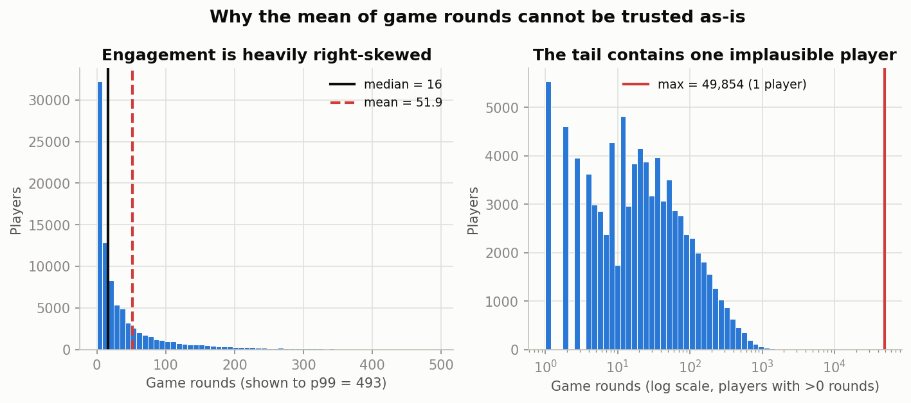
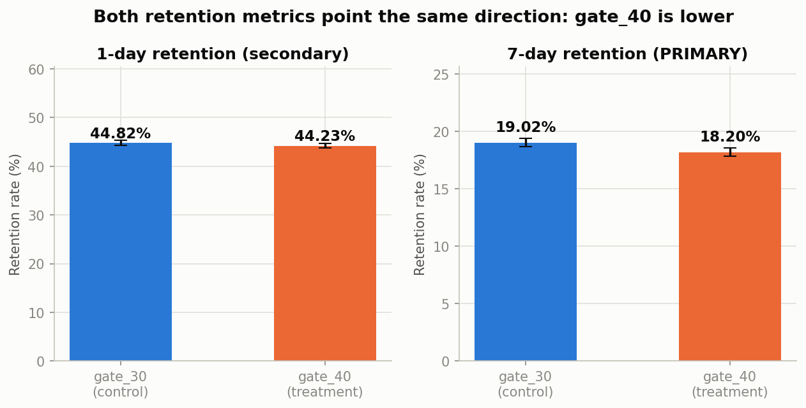
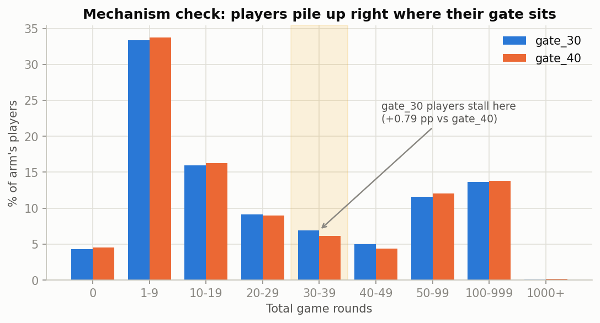
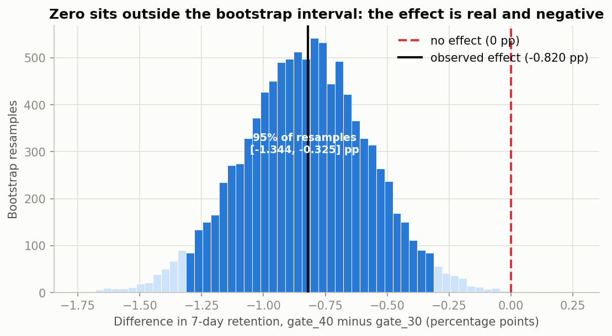
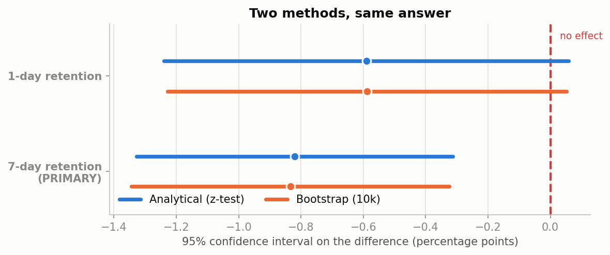
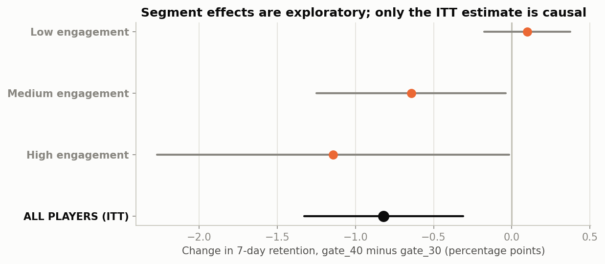

# Should Cookie Cats Move the First Gate from Level 30 to Level 40?

**Executive recommendation: No. Keep the gate at level 30.**

An A/B test on **90,189 players** shows that moving the first progression gate from level 30
to level 40 **reduced 7-day retention by 0.82 percentage points** (19.02% → 18.20%) — a
**4.3% relative decline**. The effect is statistically significant and the confidence
interval lies entirely below zero. **No metric in the experiment improved.**

| | |
|---|---|
| **Key finding** | Moving the gate later made retention worse, not better. Engagement volume was unchanged, so the gate affects *whether players return*, not *how much they play*. |
| **Treatment effect** | **−0.82 pp** on 7-day retention (95% CI **[−1.33, −0.31] pp**), −4.3% relative |
| **Statistical evidence** | Two-proportion z-test, p = 0.0016, 89% power. Bootstrap (10,000 resamples) reproduces the interval to within 0.02 pp; `gate_40` lost in **99.9%** of simulated re-runs. |
| **Business implication** | Per **1,000,000** new players, shipping `gate_40` would cost roughly **8,200 fewer players still active at day 7** (range 3,100–13,300). |

**The decision is not close.** It is not merely that `gate_40` failed to win — it lost on the
primary metric with no offsetting gain anywhere else.

---

## Contents

1. [Business problem](#1-business-problem)
2. [Experiment design](#2-experiment-design)
3. [Dataset](#3-dataset)
4. [Data quality](#4-data-quality)
5. [Metrics](#5-metrics)
6. [Methodology](#6-methodology)
7. [Results](#7-results)
8. [Bootstrap analysis](#8-bootstrap-analysis)
9. [Segment analysis](#9-segment-analysis)
10. [Limitations](#10-limitations)
11. [Recommendation](#11-recommendation)
12. [Future experimentation](#12-future-experimentation)
13. [Repository structure & how to run](#13-repository-structure)

---

## 1. Business problem

Cookie Cats is a mobile puzzle game. At a fixed level it places a **gate** — a forced wait
that blocks progression until the player waits out a timer, asks friends for help, or pays.
The gate serves two purposes at once: it paces consumption of content, and it creates the
friction that monetizes the game.

Gate placement is therefore a genuine business trade-off, not a UX detail:

- **Too early**, and players hit a wall before they are invested enough to tolerate it. They churn.
- **Too late**, and players burn through content without the forced break that (in theory) preserves long-run appetite — and the monetization moment arrives later.

The product team proposed moving the first gate from **level 30 to level 40** on the theory
that a later gate feels less punishing. The question this analysis answers:

> **Should Cookie Cats keep the first gate at level 30, or move it to level 40?**

## 2. Experiment design

| Element | Value |
|---|---|
| **Unit of randomization** | Player (`userid`), assigned at install |
| **Control** | `gate_30` — first gate at level 30 (status quo) — 44,700 players |
| **Treatment** | `gate_40` — first gate at level 40 — 45,489 players |
| **Total sample** | 90,189 players |
| **Observed allocation** | 49.56% / 50.44% |
| **Analysis population** | Intent-to-treat — all randomized players, including those who never played |

**Why intent-to-treat.** Roughly **63% of players never reached level 30**, so the gate's
position was irrelevant to them. It is tempting to exclude them for a "cleaner" test. That
would be wrong: reaching level 30 is *itself affected by the treatment*, so filtering on it
breaks randomization. ITT is both the statistically valid choice and the
business-relevant one — the company ships to all new players, not just the ones who get deep.

The consequence is a **diluted but unbiased** estimate: the true effect on *exposed* players
is necessarily larger than the 0.82 pp measured across everyone.

## 3. Dataset

One row per player, five columns, no time dimension.

| Column | Type | Description | Timing |
|---|---|---|---|
| `userid` | int | Unique player identifier | Pre-treatment (identifier only) |
| `version` | str | `gate_30` or `gate_40` | **Assignment** |
| `sum_gamerounds` | int | Total game rounds played in the observation window | **Post**-treatment |
| `retention_1` | bool | Returned 1 day after install | **Post**-treatment (outcome) |
| `retention_7` | bool | Returned 7 days after install | **Post**-treatment (outcome) |

**The most consequential fact about this dataset is what it lacks.** Every behavioural column
is measured *after* randomization. There are no pre-experiment covariates, no timestamps, no
revenue, no country or device. This single constraint drives three decisions downstream:
CUPED cannot be applied, no covariate balance check is possible, and any segmentation is
necessarily post-treatment segmentation.

## 4. Data quality

Full detail in [`notebooks/01_data_quality.ipynb`](notebooks/01_data_quality.ipynb).

| Check | Result | Verdict |
|---|---|---|
| Rows = unique users | 90,189 = 90,189 | Pass |
| Missing values | 0 across all columns | Pass |
| Duplicate user IDs / rows | 0 / 0 | Pass |
| User in exactly one arm | 0 users in both arms | Pass |
| Impossible values | 0 negative round counts | Pass |
| **Sample ratio mismatch** | 50.44 / 49.56, chi-square **p = 0.0086** | Not flagged (below the p < 0.001 threshold) — documented as a health concern |
| **Extreme outlier** | 1 player with **49,854 rounds** — 17× the next highest | Action required |
| Pre-treatment covariates | None | Constraint |

### Two findings that changed the analysis

**1. One player distorts every engagement average.**

A single player logged 49,854 game rounds — against a median of 16 and a next-highest of
2,961. Over a two-week window that is not plausible human play; it is a bot or a logging
error. **That player sits in the control arm.**

> The apparent "gate_30 players play 1.16 more rounds" finding **collapses to 0.04 rounds**
> when that one row is removed.

Any analysis reporting an engagement difference without this check is reporting an artifact
of one row out of 90,189. All engagement comparisons here use **median, winsorized mean, and
rank-based tests**. Retention is structurally immune — a boolean contributes one `True`
regardless of round count — and was verified robust (removing the player shifts the primary
effect by 0.002 pp).



**2. The sample ratio deviates from the assumed design.**

The split is 50.44/49.56 against an assumed 50/50 design. The chi-square goodness-of-fit test
gives **p = 0.0086**.

> **SRM test p = 0.0086. This does not cross the pre-specified p < 0.001 SRM detection
> threshold, so the experiment is not flagged as failed — but the deviation is documented
> here as a potential experiment-health concern.**

The p < 0.001 threshold (rather than 0.05) is standard practice for SRM specifically, because
these checks run on very large samples where trivially small allocation drift becomes
"significant" at 0.05 and would trigger constant false alarms.

Being precise about what this does and does not mean:

- **It does not invalidate the experiment** by the stated criterion, and an imbalance in *arm
  size* does not by itself bias a *rate* comparison — the z-test explicitly accounts for
  unequal group sizes.
- **It is not nothing either.** A split this uneven or worse would arise by chance roughly
  **1 time in 116** under a true 50/50 coin flip. The absolute gap is 789 users.
- **The most likely benign explanation** is that the true allocation was never exactly 50/50 —
  a hash-bucket assignment that does not divide evenly, or a design intentionally running
  slightly hot on treatment. The intended allocation is undocumented, so 50/50 is an
  assumption, not a known fact.

The underlying concern SRM signals is non-random selection into arms. That is tested directly
via the falsification checks in section 7 — a more informative probe than the ratio alone.

## 5. Metrics

| Role | Metric | Type |
|---|---|---|
| **Primary** | `retention_7` — returned 7 days after install | Binary proportion |
| Secondary | `retention_1` — returned 1 day after install | Binary proportion |
| Secondary / guardrail | `sum_gamerounds` — total rounds played | Skewed count |

### Why 7-day retention is the primary metric

1. **Closest to the business outcome.** Mobile games earn from players who form a habit. D7
   is the earliest widely-used proxy for "this player is sticking around" that a short
   experiment can measure.
2. **It is the only metric that can detect this change.** The gate sits at level 30 or 40.
   Most players are nowhere near level 30 after 24 hours — so **D1 largely measures a period
   before the treatment is even active.** Choosing D1 as primary would mean choosing a metric
   structurally insensitive to the intervention.
3. **Harder to fool.** D1 responds to onboarding polish and novelty. D7 requires a durable
   reason to return.
4. **The right guardrail for a monetization mechanic.** A gate exists partly to drive
   payment. Retention asks whether that mechanic is costing us the player base it monetizes.

**Trade-off, stated honestly:** D7 is noisier than D1 (a ~19% base rate vs ~45%), and it is
still a proxy — it is not revenue, and this dataset has none.

### Hypotheses

Let $p_{30}$, $p_{40}$ be true 7-day retention under each design.

- **H₀:** $p_{40} = p_{30}$ — moving the gate has no effect on 7-day retention
- **H₁:** $p_{40} \neq p_{30}$ — moving the gate changes 7-day retention, in either direction
- **α = 0.05**, two-sided. Rejecting H₀ is *not* sufficient to ship; practical significance is assessed separately.

## 6. Methodology

| Step | Method | Why |
|---|---|---|
| Sanity checks | Chi-square SRM test, duplicate/leakage checks | Detect a broken experiment before trusting any result |
| Primary test | **Two-proportion z-test** | Binary outcome, independent units, very large samples — the purpose-built tool. Yields a signed effect and a CI on the difference, which chi-square does not. |
| Interval estimation | Wilson CI per arm; normal-approximation CI on the difference | Wilson has better coverage than the naive interval |
| Power | Achieved power + minimum detectable effect | Distinguishes "no effect" from "too small to detect" |
| Robustness | **Bootstrap, 10,000 resamples** | Assumption-free cross-check on the analytical interval |
| Engagement | Winsorized mean + Welch t-test, Mann-Whitney U | The raw mean is corrupted by one outlier |
| Heterogeneity | Segment analysis + Bonferroni / Holm / Benjamini-Hochberg | Three segments means a 14% false-positive rate uncorrected |
| Causal credibility | **Falsification (negative-control) tests on players the gate could not have reached** | The strongest internal-validity check this dataset permits — see §7 for the logic and for the one test that came back borderline |

### On CUPED

> **CUPED was evaluated but not applied because the available dataset does not contain an
> appropriate pre-experiment covariate.**

CUPED reduces variance by adjusting the outcome using a covariate measured *before*
randomization: $Y_{\text{CUPED}} = Y - \theta(X - \bar{X})$. It requires $X$ to be strictly
pre-treatment, which is what makes the adjustment unbiased.

Here, **every behavioural column is post-treatment**. The tempting shortcut is to use
`sum_gamerounds`, which correlates 0.52 with retention. **That would be actively wrong, not
merely imperfect**: game rounds are an *outcome* of the treatment — control players
demonstrably stall at their gate — so adjusting by it partials out part of the very effect
being measured. It would yield a tighter interval around a *biased* estimate, which is worse
than an honest wide one.

**How it would work with the right data:** take a 1–4 week pre-period, use prior-period
sessions/days-active/retention as $X$, estimate $\theta$ on pooled data, verify covariate
balance, re-run the same test on the adjusted metric.

**The catch specific to this experiment:** Cookie Cats randomizes **at install**, so new
players have no pre-period by construction. CUPED is not just unavailable here — it is
largely inapplicable to new-user experiments generally. The right tools for install-time
tests are **stratified randomization or regression adjustment** on attributes known at
install (country, platform, device tier, acquisition channel). None are present in this
dataset, but all are obtainable in production.

## 7. Results

| Metric | gate_30 | gate_40 | Abs. diff | Relative | 95% CI | p-value | Significant |
|---|---|---|---|---|---|---|---|
| **7-day retention (primary)** | **19.02%** | **18.20%** | **−0.82 pp** | **−4.31%** | **[−1.33, −0.31] pp** | **0.0016** | **Yes** |
| 1-day retention | 44.82% | 44.23% | −0.59 pp | −1.32% | [−1.24, +0.06] pp | 0.074 | Not detected — **only 43% power**, so this is not evidence of no effect |
| Game rounds (winsorized) | 49.14 | 48.85 | −0.28 | −0.57% | [−1.38, +0.82] | 0.62 | Not detected |



### In plain language

Out of every 1,000 new players, about **190 come back a week later under `gate_30`**, versus
about **182 under `gate_40`** — roughly **8 fewer returning players per 1,000**.

If the gate change genuinely made no difference, a gap this large would appear about **16
times in 10,000** experiments. The 95% interval runs from −1.33 pp to −0.31 pp: **the entire
range sits below zero.** The data is consistent with the treatment being anywhere from
slightly harmful to meaningfully harmful, and is **not** consistent with it being beneficial.

### Power: why the two metrics get read differently

| Metric | Minimum detectable effect | Observed effect | Achieved power |
|---|---|---|---|
| 7-day retention | 0.74 pp | −0.82 pp | **89%** |
| 1-day retention | 0.93 pp | −0.59 pp | **43%** |

The D7 test was **well powered** — the significant result is not a lucky draw from an
underpowered design.

**The D1 test was not, and this is important enough to state plainly:**

> **The experiment had only 43% power to detect a D1 effect of the size observed. The absence
> of statistical significance on 1-day retention must therefore NOT be interpreted as evidence
> that there is no effect on D1 retention.**

At 43% power, a genuine effect of that magnitude would be missed more often than it would be
caught — worse than a coin flip. What we can say is that the D1 point estimate is **negative**
(−0.59 pp), pointing the same direction as the primary metric, with an interval
([−1.24, +0.06] pp) that is almost entirely below zero. What we cannot say is that D1 is
unaffected. Reading this result as "`gate_40` is safe for D1 retention" would be a mistake.

What the D1 interval *does* rule out is a meaningful **improvement**: the upper bound is
+0.06 pp, indistinguishable from zero. So the secondary metric does not rescue the treatment,
even though it cannot convict it either.

### Statistical vs. practical significance

At n = 90,189, statistical significance is cheap — we can detect effects far too small to
matter. So the two questions are separated.

**Business impact** *(assumptions: 1,000,000 new players; measured rates hold; the sample is
representative)*:

> Shipping `gate_40` would cost roughly **8,200 fewer players still active at day 7 per
> million new players**, with a plausible range of **3,100 to 13,300 fewer**.

**Is that practically significant? Yes — and the argument is about asymmetry, not magnitude.**
A 4.3% relative retention decline is meaningful in mobile gaming, where retention compounds
into D30, payers, and organic growth. But the decisive point is simpler: **the change has no
measured upside.** Even if one judged 0.82 pp commercially marginal, we would be accepting a
real cost for **no demonstrated benefit**.

**What is deliberately not claimed:** the dataset has no revenue, ARPU, or LTV. No dollar
figure is produced, because it would have to be invented.

### The mechanism is visible in the data



In the **30–39 round band**, 6.91% of `gate_30` players stall versus 6.13% of `gate_40`
players — a **+0.79 pp** excess exactly where the control arm's gate sits. This confirms the
treatment was genuinely delivered and supports reading the retention gap as gate-driven.

### Falsification tests: is the effect actually caused by the gate?

#### What a falsification test is, and why these subgroups qualify

A falsification test (also called a negative-control or placebo test) looks for an effect
**in a place where the causal mechanism says there cannot be one**. If an effect turns up
there anyway, the mechanism is not the only thing driving the result.

The logic chain here is:

```
The treatment changes WHERE the first gate sits (level 30 → level 40)
        ↓
A gate can only affect a player who actually reaches it
        ↓
A player at level L must have played at least L rounds
        ↓
So a player with <30 rounds never reached level 30
        ↓
...and therefore encountered NEITHER gate
        ↓
The treatment cannot have acted on them THROUGH THE GATE MECHANISM
```

So if we *do* measure a difference between arms among those players, it points to something
other than the gate: **a randomization problem, a measurement/logging issue, a selection
effect, or some mechanism we have not accounted for.** That is what makes this a meaningful
test rather than a descriptive split.

One subtlety worth being explicit about: subsetting on round count is subsetting on a
post-treatment variable, which is usually dangerous. It is defensible *here* only because
neither gate can influence behaviour **before** level 30 is reached — so membership in
"fewer than 30 rounds" is not something the treatment can change. The `≥40 rounds` row does
**not** have that protection and is flagged separately below.

#### Results

| Subgroup | Could the gate affect them? | Effect on D7 | 95% CI | p-value |
|---|---|---|---|---|
| 0 rounds (never played) | No — impossible | −0.19 pp | [−0.72, +0.33] | 0.47 |
| <10 rounds | No — impossible | −0.01 pp | [−0.28, +0.26] | 0.95 |
| <20 rounds | No — impossible | −0.12 pp | [−0.42, +0.19] | 0.45 |
| <30 rounds | No — impossible | −0.33 pp | [−0.65, −0.001] | **0.049** |
| ≥40 rounds | Yes (selection risk) | **−1.78 pp** | [−2.96, −0.60] | 0.003 |
| **All players (ITT)** | Mixed | **−0.82 pp** | [−1.33, −0.31] | **0.0016** |

#### Interpretation — stated precisely

**The tests that pass cleanly.** For the 0-round, <10-round and <20-round subgroups, the
estimated effects are small (−0.19, −0.01, −0.12 pp) with p-values of 0.47, 0.95 and 0.45.
These are **consistent with no detectable difference**, which is what the mechanism requires.

**The test that does not pass cleanly.** The `<30 rounds` subgroup gives an estimated effect
of −0.33 pp with **p = 0.049**, which is *below* the conventional 5% threshold. It would be
incorrect to describe this as confirming a zero effect. Stated properly:

> The estimated effect among players with <30 rounds is close to zero in magnitude, but the
> falsification test is **borderline at the conventional 5% threshold (p = 0.049)**.
> **This subgroup therefore does not provide clean evidence of a zero effect**, and it should
> be interpreted cautiously. On its own it is a mild warning that some portion of the headline
> difference may not be attributable to the gate mechanism.

Three considerations bear on how much weight it deserves — offered as context, **not** as
grounds for dismissing it:

1. **The tighter nested subsets are clean.** <10 rounds (p = 0.95) and <20 rounds (p = 0.45)
   show nothing. If randomization were broken, an imbalance should generally appear there too.
2. **This is one of six tests reported.** At α = 0.05, a single p-value just under 0.05 across
   six tests is close to what chance alone produces; no multiplicity correction would retain it.
3. **The magnitude is small and the interval barely excludes zero** (upper bound −0.001 pp).

**Net position.** The overall pattern — clean nulls in the subgroups furthest from the gate,
and the largest effect among players deep enough to reach one — is what a genuine causal
effect looks like, and a spurious result from broken randomization would not generally respect
that boundary. But the `<30 rounds` result is a real, unresolved caveat on internal validity,
not a rounding detail. **It is the single strongest argument for a confirmatory re-run before
treating this decision as permanently settled**, and it is carried into the limitations
section rather than being written off.

**Why the ≥40 rounds row is not the headline.** It is the most dramatic number in the table and
the most tempting to lead with. We do not, because that subgroup is **selected on a
post-treatment variable**: reaching 40 rounds requires passing a gate under `gate_30`, so
control players in that subgroup are a more selected, more motivated population. The
comparison is biased by construction — suggestive of mechanism, not an effect estimate.

## 8. Bootstrap analysis

The analytical CI assumes the sampling distribution is approximately normal. The bootstrap
assumes nothing about its shape: it repeatedly resamples each arm **with replacement**,
recomputes the difference, and reads the middle 95% of the resulting spread.



| Metric | Analytical 95% CI | Bootstrap 95% CI (10,000) | Max endpoint gap |
|---|---|---|---|
| **7-day retention** | [−1.328, −0.312] pp | [−1.344, −0.325] pp | **0.016 pp** |
| 1-day retention | [−1.239, +0.058] pp | [−1.228, +0.053] pp | 0.012 pp |

**The two methods agree to within 0.02 pp** — about one part in fifty of the interval width.
Standard errors match to three decimals (0.2592 vs 0.2582 pp).

> **`gate_40` was worse in 99.9% of 10,000 simulated re-runs of the experiment.**

This is the useful outcome of a robustness check: not a new finding, but confirmation that
the conclusion is not an artifact of the formula chosen.



## 9. Segment analysis

**Read as exploratory. Nothing in the recommendation rests on it.**

The only variable rich enough to segment on is `sum_gamerounds` — a **post-treatment
variable**. Splitting on it means splitting on something the treatment itself influences: a
`gate_30` player who quit at the level-30 wall lands in "medium engagement", while the same
player under `gate_40` might have reached "high". The segments contain **different kinds of
people in each arm**, so within-segment comparisons are no longer randomized comparisons.
This is collider-stratification bias, and sample size does not fix it.



| Segment | gate_30 | gate_40 | Diff | Raw p | Bonferroni | Holm | FDR |
|---|---|---|---|---|---|---|---|
| Low engagement | 1.45% | 1.55% | +0.10 pp | 0.475 | 1.000 | 0.475 | 0.475 |
| Medium engagement | 8.13% | 7.49% | −0.64 pp | 0.037 | 0.112 | 0.112 | 0.070 |
| High engagement | 47.08% | 45.94% | −1.14 pp | 0.047 | 0.141 | 0.112 | 0.070 |

### The multiple-comparisons problem

Three tests, each with its own 5% false-positive rate, give a family-wise error rate of
**1 − 0.95³ ≈ 14%**, not 5%. Medium and High look significant on raw p-values. **After
correction, none of them is** — all three methods agree.

An analyst who ran these tests and reported "the effect is concentrated among engaged players
(p < 0.05)" would be reporting noise dressed as a finding.

**What can be said:** the direction is consistent, and the effect is numerically largest among
high-engagement players — mechanically plausible, since those are the players who reach a
gate. **What cannot be said:** that the treatment effect differs by segment.

**No cherry-picking.** All three segments are reported, including the Low-engagement segment
that shows a small *positive* (non-significant) difference for `gate_40`.

## 10. Limitations

### Randomization
- **Sample ratio deviation.** SRM test p = 0.0086. This does **not** cross the pre-specified
  p < 0.001 detection threshold, so the experiment is not flagged as failed — but the
  deviation is documented as a potential experiment-health concern. The intended allocation
  is undocumented; 50/50 is an assumption.
- **One falsification test is borderline** (<30 rounds, −0.33 pp, p = 0.049) where the
  mechanism implies no effect. **This subgroup does not provide clean evidence of a zero
  effect** and cannot be written off as confirmed-null. Tighter nested subsets (<10, <20
  rounds) are clean, and it is one of six tests — but it remains an unresolved caveat on
  internal validity and the strongest argument for a confirmatory re-run.
- **No covariate balance check is possible.** With no pre-treatment attributes, we cannot
  verify the arms were comparable at baseline. SRM plus falsification tests are weaker
  evidence than a full balance table.

### Data
- **One extreme outlier** (49,854 rounds) corrupts engagement means; handled with robust
  methods. The primary metric is verified robust to it.
- **No timestamps** — cannot check for novelty effects, seasonality, or whether both arms ran
  over the same calendar window. If they did not, the confound is undetectable here.
- **Metric definitions undocumented** — no data dictionary ships with the dataset.
- **Observation window unknown** — we assume no player's D7 outcome was censored.

### Statistical
- **D1 is underpowered (43% power against the observed effect).** The experiment had limited
  power to detect a D1 effect of the size observed, so **the absence of statistical
  significance must not be interpreted as evidence of no effect on D1 retention.** The point
  estimate is negative (−0.59 pp) and the interval is almost entirely below zero.
- **Multiple testing** across metrics, segments, and falsification subgroups. The primary
  metric was designated in advance; segment tests are corrected and none survive. No claim
  rests on an uncorrected exploratory test.
- **Significance is cheap at n = 90,189.** The decision rests on the interval lying wholly
  below zero *and* the absence of any offsetting benefit — not on the p-value.
- **All segmentation is post-treatment** and explicitly labelled exploratory.

### Business / external validity
- **Retention is a proxy, not the objective.** A gate is a monetization mechanic; `gate_40`
  could in principle lower retention while raising revenue per player. **This dataset cannot
  test that.** It is the most important unanswered question in the analysis.
- **Short horizon.** D7 says nothing about D30 or D90.
- **Single cohort, single window.** Generalization to other regions, platforms, or future
  cohorts is an assumption.
- **Only two positions tested.** Nothing is known about level 20, level 35, or no gate at all
   — and the data is consistent with "earlier is better", which this experiment never tested.
- **~63% of the sample was never exposed** to either gate, diluting the measured effect.

## 11. Recommendation

### **KEEP GATE 30 — do not ship `gate_40`.**

**Evidence**
- 7-day retention, the pre-designated primary metric, is **0.82 pp lower** under `gate_40`
  (−4.3% relative), p = 0.0016, with a 95% CI of **[−1.33, −0.31] pp** that lies entirely
  below zero.
- The test was **well powered** (89%) for the effect observed.
- **Bootstrap confirms it** — 10,000 resamples reproduce the interval to 0.02 pp; `gate_40`
  lost in 99.9% of simulated re-runs.
- **Robust to the outlier** — excluding the anomalous player moves the effect by 0.002 pp.
- **Falsification tests are largely supportive** — no detectable difference among players
  furthest from reaching a gate (<10 rounds: p = 0.95; <20 rounds: p = 0.45), with the effect
  concentrating among players deep enough to reach one. **With one exception:** the <30-round
  subgroup is borderline (p = 0.049) and does not provide clean evidence of a zero effect —
  see Risk below.
- **No offsetting benefit anywhere.** 1-day retention also moved negative (though
  underpowered); engagement volume was flat.

**Business impact**
- Roughly **8,200 fewer 7-day-retained players per 1,000,000 new players** (range
  3,100–13,300), under clearly stated assumptions. Not converted to revenue — the dataset
  has none.

**Risk**
- Retention is a proxy. A gate is a monetization mechanic, and it is possible `gate_40`
  trades retention for revenue per player. **This experiment cannot rule that out** — but
  nor is there any evidence for it, and we should not ship a measured retention loss on an
  untested hope.
- **Two experiment-health items are unresolved** and together justify a confirmatory re-run
  before treating this decision as permanent: the sample-ratio deviation (p = 0.0086 — below
  the p < 0.001 detection threshold, but documented), and the borderline <30-round
  falsification test (p = 0.049), which does not cleanly confirm a zero effect where the
  mechanism implies one.
- **D1 retention is genuinely unresolved**, not clean. At 43% power we cannot claim the
  treatment is harmless to D1; we can only say we did not detect an effect.

**Next step**
- Keep `gate_30`. Run **gate_20 vs gate_30** next, and instrument revenue first.

## 12. Future experimentation

1. **Test the opposite direction — `gate_20` vs `gate_30`.** The most interesting implication
   of this result is that the data is consistent with *earlier gates being better*, a
   hypothesis this experiment never tested. It is the highest-value next test.
2. **Instrument revenue before the next gate test.** The inability to observe ARPU is the
   binding limitation on every gate decision. Add revenue-per-player and gate-encounter
   events to the experiment schema.
3. **Extend the observation window to 30 days** to confirm the gap persists rather than
   attenuating.
4. **Add level-progression tracking** so exposed players can be identified directly rather
   than inferred from round counts — enabling a clean complier-effect estimate.
5. **Capture install-time attributes** (country, platform, device, channel) to enable
   stratified randomization and regression adjustment — the correct variance-reduction tools
   for new-user experiments, where CUPED does not apply.
6. **Log the intended allocation** so SRM checks test the real design rather than an assumed
   50/50.

## 13. Repository structure

```
cookie-cats-ab-testing/
├── data/
│   └── cookie_cats.csv               # 90,189 players, 5 columns
├── notebooks/
│   ├── 01_data_quality.ipynb         # Sanity checks, SRM, outlier detection
│   ├── 02_experiment_analysis.ipynb  # Metrics, hypotheses, focused EDA
│   ├── 03_statistical_testing.ipynb  # z-tests, power, CUPED, segments, falsification
│   └── 04_bootstrap_analysis.ipynb   # 10,000-resample robustness check
├── src/
│   └── experiment_analysis.py        # Reusable A/B testing module
├── reports/
│   ├── experiment_memo.md            # One-page stakeholder memo
│   └── figures/                      # Generated charts
├── powerbi/
│   ├── data/                         # 9 import-ready tables for BI
│   ├── measures.dax                  # DAX measures incl. a live z-test
│   └── CLAUDE_PROMPT.md              # Prompt to build the dashboard
├── README.md
├── requirements.txt
└── .gitignore
```

### Power BI dashboard

[`powerbi/`](powerbi/) contains everything needed to build an interactive dashboard on this
analysis: nine modelled tables, a DAX measure set (including a two-proportion z-test written
in DAX, so significance recomputes live under any slicer), and a build prompt.

The statistics stay in Python; Power BI handles presentation only. The folder's
[README](powerbi/README.md) carries the guardrails the dashboard must respect — chiefly that
1-day retention is underpowered rather than null, and that segment results are exploratory.

### Reusable module

[`src/experiment_analysis.py`](src/experiment_analysis.py) is written to work on **any
two-arm A/B test** with one row per randomized unit — column names and group labels are
parameters, not hardcoded values.

| Function | Purpose |
|---|---|
| `experiment_summary()` | Row/unit counts, duplicates, missing values, group split, leakage check |
| `randomization_check()` | Chi-square SRM test against any expected allocation |
| `calculate_conversion_rate()` | Rate, successes, and n per group for a binary metric |
| `calculate_lift()` | Absolute (pp) and relative (%) lift |
| `proportion_test()` | Two-proportion z-test with one/two-sided options |
| `confidence_interval()` | Wilson (default) CI for a single proportion |
| `diff_confidence_interval()` | CI on the difference between two proportions |
| `bootstrap_effect()` | Bootstrap the treatment effect for any metric and statistic |
| `segment_analysis()` | Per-segment effects with tests, for heterogeneity exploration |

Every function documents **what it does, why it is used, and what the result means**.

### How to run

```bash
pip install -r requirements.txt
jupyter notebook notebooks/
```

Run notebooks in order (01 → 04). All figures regenerate into `reports/figures/`. The
bootstrap uses a fixed seed (42), so results are reproducible.

---

## Analytical principles applied

This project deliberately avoids the common failure modes of A/B test write-ups:

- **A primary metric designated before looking at results**, with the reasoning stated.
- **No causal claims from post-treatment segments** — the bias is named and the analysis is labelled exploratory.
- **Multiple-comparison correction applied**, and the conclusion reported honestly when *no* segment survives.
- **CUPED evaluated and refused** rather than faked with a post-treatment covariate.
- **Power reported alongside every null**, so "not detected" is never passed off as "no effect".
- **Practical significance separated from statistical significance.**
- **Falsification (negative-control) tests** on subgroups the treatment mechanism could not
  have reached — with the borderline one reported as *not* clean rather than claimed as a pass.
- **No invented revenue figures.** Every assumption is labelled.
- **The inconvenient results are reported** — the borderline falsification test, the SRM
  imbalance, the underpowered secondary metric.
